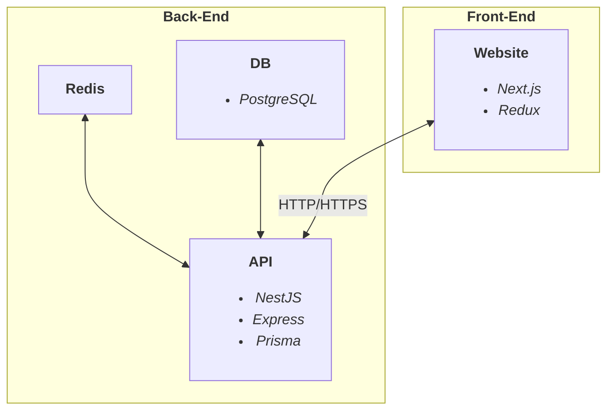

<h1 align="center">Share Ur Save</h1>

## Architecture

```mermaid
    graph BT
        subgraph Frond-End[<b>Front-End</b>]
            Website[<b>Website</b><br /><ul><li><i>Next.js</i></li><li><i>Redux</i></li></ul>]
        end
        subgraph Back-End[<b>Back-End</b>]
            API[<b>API</b><br /><ul><li><i>NestJS</i></li><li><i>Express</i></li><li><i>Prisma</i></li></ul>]
            Redis[<b>Redis</b>]
            DB[<b>DB</b><br /><ul><li><i>PostgreSQL</i></li></ul>]
            API <--> Redis
            API <--> DB
        end
    API <-- HTTP/HTTPS --> Website
```