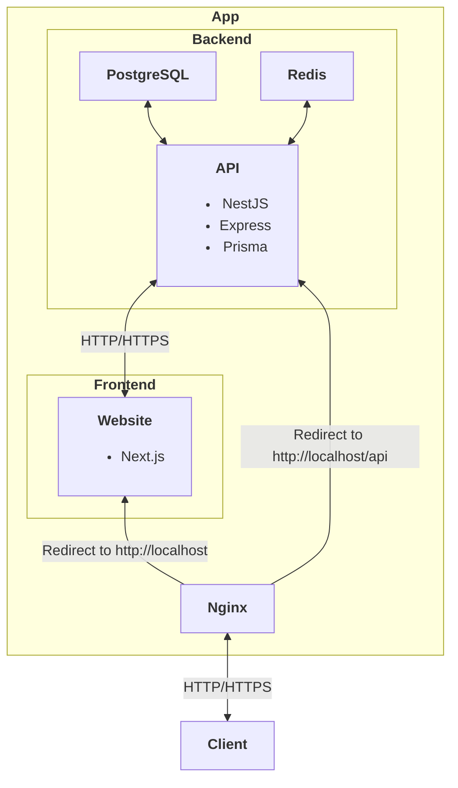

<h1 align="center">Share Ur Save</h1>


## Architecture



## Installation

### Prerequisites

-   **Node.js** and **npm/yarn**
-   **Docker**
-   **PostgreSQL** and **Redis**

### Clone Project

```bash
git clone --recurse-submodules https://github.com/FiestaTheNewbieDev/share-ur-save.git
```

## GitHub Submodules Repositories

-   **Backend**: https://github.com/FiestaTheNewbieDev/share-ur-save-backend.git
-   **Frontend**: https://github.com/FiestaTheNewbieDev/share-ur-save-frontend.git
